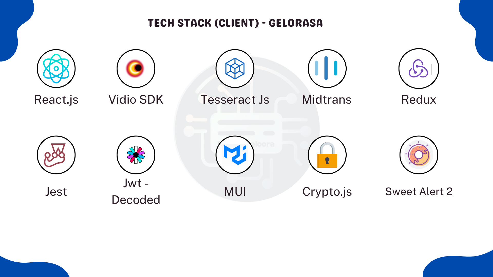

# Gelora-Rasa


Gelorasa is a web platform designed to provide information on nearby events, based on user location. This website not only displays offline events but also offers a variety of online and hybrid events. With Gelorasa, users can easily find and participate in various events, whether physically organized or virtual, according to their interests and needs. Additionally, Gelorasa provides opportunities for every individual who wishes to start as an event organizer.

For more up-to-date information on what's being implemented, take a look at our current [Boards](https://github.com/aws-samples/aws-serverless-airline-booking/projects).

> **Note**
>
> This project is still in development and will always be updated whenever the author gains new insights.


## Deployment

To get started with this system, you can deploy follow this steps:
## Frontend Setup

1. Install dependencies:

```
npm install
```

2. Start the application:

```
npm run start
```

## Backend Setup

1. Install dependencies:

```
npm install
```

2. Create the database:

```
npx sequelize-cli db:create
```

3. Migrate the database:

```
npx sequelize-cli db:migrate
```

4. Seed the database:

```
npx sequelize-cli db:seed:all
```

5. Start the development server:

```
npm run start
```

---


## Stack

Summary of what the stack looks like now including a picture with the core tech:




### Frontend

The frontend of Gelorasa is built using the following technologies:

- **Framework:** React
- **Build Tool:** Vite
- **State Management:** Redux with react-redux
- **Side Effects:** Redux Saga
- **Styling:** Material UI, Sass
- **Form Handling:** React Hook Form
- **Streaming:** VidioSDK Live && HLS
- **Text Detection:** Tesseract.js
- **Payment:** Midtrans
- **Handling API:** Axios
- **Notification:** React Hot Toast & sweet alert
- **Internationalization:** React Intl
- **Additional Libraries:** React Countdown, Jwt Decoded, React Quill

### Auth

Authentication in Gelorasa is handled using the following technologies:

- **JSON Web Token (JWT)**: For token-based authentication.
- **Bcrypt**: Library for password hashing.
- **CryptoJS**: Used for decryption and encryption

### Backend

The backend API of Gelorasa is implemented with the following technologies:

- **Framework:** Express
- **Database:** MySQL
- **ORM:** Sequelize
- **Caching:** Redis (ioredis)
- **Validation:** Joi
- **Image Upload:** Multer
- **Handling env:** Dotenv
- **Testing:** Jest & Supertest

### External Services

- **Food Data:** [Location API](https://wilayah.id/api/provinces.json)

## API Endpoints

For detailed information about the API endpoints, setup and environment variables in Gelorasa, please refer to the [API Endpoints README](./server/README.md).

## Client Routes

For detailed information about the client routes and setup in Gelorasa, please refer to the [Client Routes README](./client/README.md).

## System Flow


